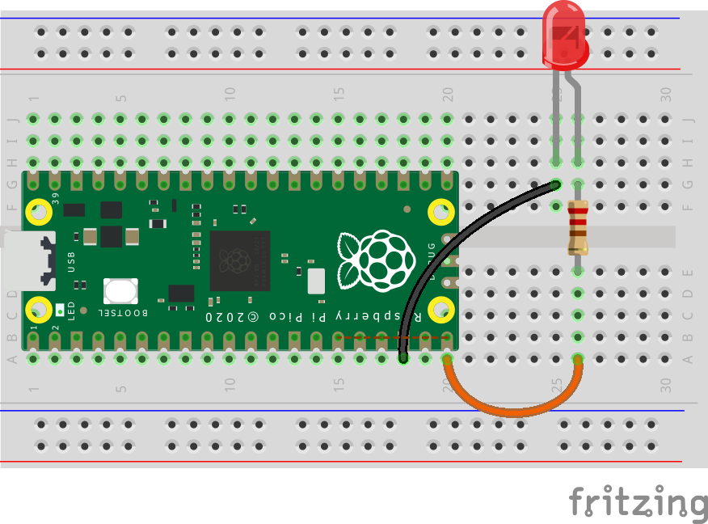
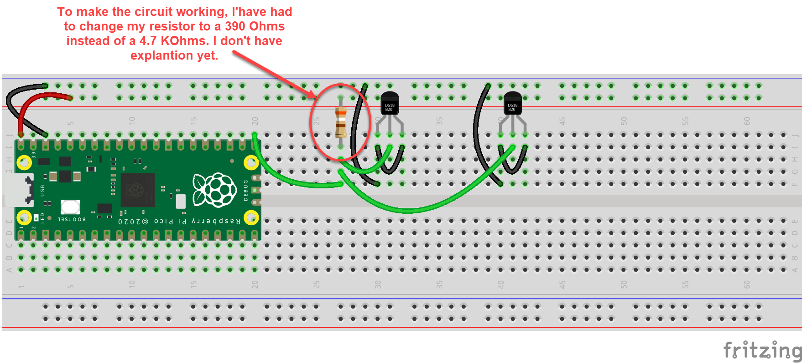

# Pico2040-discovery

## Board informations 

## Upload a project 
To upload a program on the Pi Pico and make it the default program that will run on the board at boot, then simply save your program in a **main.py** file directly on the board.

Using VS Code, it seem to have a little bug when you've a workspace with multiple project folder. To avoid any problem, open the folder you want to uplad directly in VS Code.

## Examples : 
- **blink** and **blinkExternalLed** show how to declare and use GPIO.

### Blinky External LED
This example show how to use GPIO in output mode.

## Notes on the shared examples  

### DS18B20 in parasite mode
The parasite mode is interesting cause we only need 2 wires (instead of 3 in normal mode). It couldn't be use in all situation, but sometimes it's interesting to use it. Here, in the parasite mode, I've had to change the resistor value to something lower than the requested 4.7KOhms. I don't know why. I'll take time to see if the problem is only for the Pico Pi or if I can reproduce it with the another board (Arduino Nano or other).

Explanation for the parasite mode : https://learn.openenergymonitor.org/electricity-monitoring/temperature/DS18B20-temperature-sensing?redirected=true

